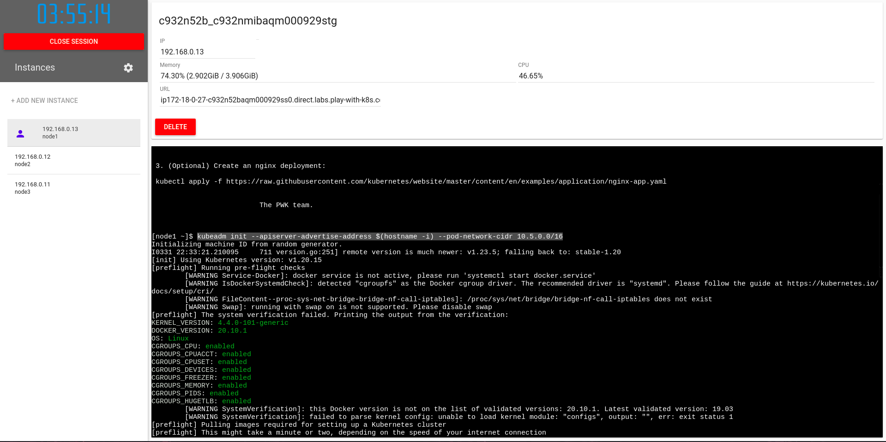

# Preparación de un clúster Kubernetes de 5 nodos

## Pre-requisitos:

- Plataforma Play with Kubernetes
- 5 nodos para un closter de Kubernetes

## Preparación de un clúster Kubernetes de 5 nodos
Para empezar con Kubernetes, siga los siguientes pasos:

- Inicia https://play-with-k8s.com en el navegador

Click en "Add new Instance" para agregar el primer nodo del closter

## Ejecuta los siguientes comandos:

```
kubeadm init --apiserver-advertise-address $(hostname -i)
mkdir -p $HOME/.kube
chown $(id -u):$(id -g) $HOME/.kube/config
kubectl apply -n kube-system -f \
    "https://cloud.weave.works/k8s/net?k8s-version=$(kubectl version | base64 |tr -d '\n')"
```
Al correr esos comandos se inicia un nodo maestro, el cual se encargará de orquestar los nodos que ejersan el papel de "workers", de igual manera muestra un ```hash``` con el cual nuevos nodos podran formar parte del closter.



## Agregando nuevos nodos al closter

Click en ```Add new Instances``` para agregar nuevas instancias al closter

copia el ```hash``` y agregalo al comando ```kubeadm join .....``` en los nodos workers.

## Configurando el nodo worker

Click en ```Add New Instances``` y pega el último comando ```kubeadm``` en los nuevos nodos workers

```
[node2 ~]$ kubeadm join 192.168.0.8:6443 --token ek62ku.t5yfwvte9bcca2y0 \
> --discovery-token-ca-cert-hash sha256:948150d8984d4f57355e220b42581babceedc8837fe5cf006d09a0c812bfb8ee
```
Deberias ver la siguiente salida:
```
[kubeadm] WARNING: kubeadm is in beta, please do not use it for production clusters.
[preflight] Skipping pre-flight checks[discovery] Trying to connect to API Server "192.168.0.8:6443"
[discovery] Created cluster-info discovery client, requesting info from "https://192.168.0.8:6443"
[discovery] Requesting info from "https://192.168.0.8:6443" again to validate TLS against the pinned public key
[discovery] Cluster info signature and contents are valid and TLS certificate validates against pinned roots, will use API Server "192.168.0.8:6443"[discovery] Successfully established connection with API Server "192.168.0.8:6443"
[bootstrap] Detected server version: v1.8.15
[bootstrap] The server supports the Certificates API (certificates.k8s.io/v1beta1)
Node join complete:
* Certificate signing request sent to master and response
  received.
* Kubelet informed of new secure connection details.

Run 'kubectl get nodes' on the master to see this machine join.
[node2 ~]$
```

## Verificando el funcionamiento del closter
Ejecuta el siguiente comando
```
[node1 ~]$ kubectl get nodes
NAME      STATUS    ROLES     AGE       VERSION
node1     Ready     master    15m       v1.10.2
node2     Ready     <none>    1m        v1.10.2
[node1 ~]$
```

```
[node1 ]$ kubectl get svc
NAME         TYPE        CLUSTER-IP   EXTERNAL-IP   PORT(S)   AGE
kubernetes   ClusterIP   10.96.0.1    <none>        443/TCP   1h
[node1] $
```

## Muestra la capacidad de nuestros nodos en un archivo JSON
```
kubectl get nodes -o json |
      jq ".items[] | {name:.metadata.name} + .status.capacity"
```

## Accediento a los namespaces
Por default, ```kubectl``` usa el namespace predeterminado. Nosotros podemos usar un distinto namespace con la opción -n.

## Enumera los pods en el namespace kube-system:
```
kubectl -n kube-system get pods
```
```
[node1 kubelabs]$ kubectl get pods -n kube-system
NAME                            READY   STATUS    RESTARTS   AGE
coredns-6dcc67dcbc-4sw6m        1/1     Running   0          2m15s
coredns-6dcc67dcbc-x4qnk        1/1     Running   0          2m15s
etcd-node1                      1/1     Running   0          108s
kube-apiserver-node1            1/1     Running   0          84s
kube-controller-manager-node1   1/1     Running   0          104s
kube-proxy-9gljr                1/1     Running   0          2m5s
kube-proxy-9zktt                1/1     Running   0          2m15s
kube-proxy-qvqrf                1/1     Running   0          107s
kube-scheduler-node1            1/1     Running   0          105s
weave-net-78bxz                 2/2     Running   0          2m15s
weave-net-g2cf6                 2/2     Running   0          2m5s
weave-net-hxqd9                 0/2     Evicted   0          19s
```

## ¿Qué son todos estos pods? 
- etcd es nuestro servidor etcd
- kube-apiserver es el servidor API
- kube-controller-manager y kube-scheduler son otros componentes maestros
- kube-dns es un componente adicional (no es obligatorio, pero es muy útil, así que está ahí)
- kube-proxy es el componente (por nodo) que gestiona las asignaciones de puertos y demás
- weave es el componente (por nodo) que gestiona la red superpuesta

La columna ```READY``` indica el numero de contenedores en cada pod. Los pods cuyo nombre termina en ```-node1``` son los componentes maestros (han sido específicamente "anclados" al nodo maestro)

## Ejecuta el siguiente comando

```
kubectl apply -f https://raw.githubusercontent.com/portainer/portainer-k8s/master/portainer-nodeport.yaml
```


## Verifica con el siguiente comando

```
[node1 kubelabs]$ kubectl get po,svc,deploy -n portainer
NAME                             READY   STATUS    RESTARTS   AGE
pod/portainer-58767884bc-jqfnn   1/1     Running   2          13m

NAME                TYPE       CLUSTER-IP       EXTERNAL-IP   PORT(S)                         AGE
service/portainer   NodePort   10.111.121.188   <none>        9000:30777/TCP,8000:30776/TCP   13m

NAME                        READY   UP-TO-DATE   AVAILABLE   AGE
deployment.apps/portainer   1/1     1            1           13m
[node1 kubelabs]$
```
